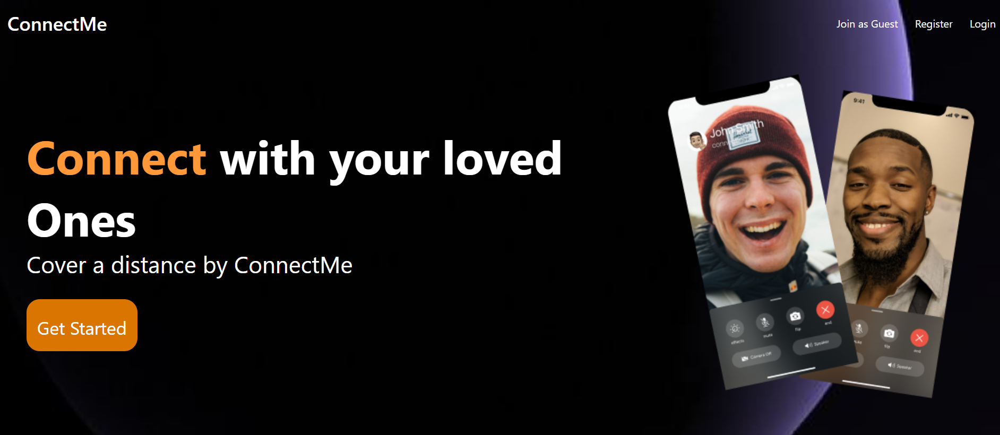
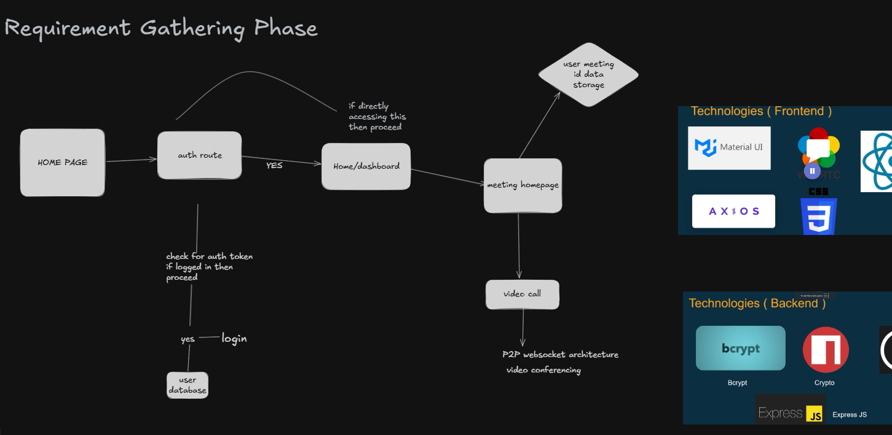

# 🚀 ConnectMe – Video Conferencing Web App

ConnectMe is a modern video conferencing web application inspired by platforms like Zoom and Google Meet. It enables users to authenticate, create or join meetings, and communicate in real time.

🔗 **Live Demo:** https://your-render-link.onrender.com  
📂 **GitHub Repository:** https://github.com/your-username/connectme  

---

## 📌 Overview

ConnectMe is designed to simulate real-world video conferencing systems. It focuses on building a responsive frontend, implementing authentication, and understanding real-time communication architecture using WebRTC and WebSockets.

---

## ✨ Features

- 🔐 User Authentication (Login / Signup)
- 🎥 Video Calling (WebRTC – in progress)
- 🔗 Create & Join Meeting Rooms
- 👥 Peer-to-Peer Communication
- 💬 Chat Feature (planned)
- 🖥️ Fully Responsive UI (Desktop + Mobile)
- 🎨 Clean and modern UI using Material UI

---

## 🛠️ Tech Stack

### Frontend
- React.js
- Material UI
- CSS (Flexbox + Responsive Design)
- Axios

### Backend (In Progress)
- Node.js
- Express.js
- MongoDB
- JWT Authentication
- Socket.IO

### Real-Time Communication
- WebRTC

---

## 📸 Screenshots

### 🏠 Home Page


---

## 🔄 Application Flow



---

## ⚙️ Installation & Setup

### 1. Clone the repository

```bash
git clone https://github.com/your-username/connectme.git
cd connectme

2. Install dependencies
npm install
3. Run the application
npm start

💡 Key Learnings
Built responsive UI using Flexbox and Material UI
Implemented authentication flow in React
Understood real-time communication concepts (WebRTC, WebSockets)
Improved debugging and UI structuring skills
Learned how to design application flow using system diagrams


🚧 Future Enhancements
🎥 Complete WebRTC video calling
💬 Real-time chat system
🖥️ Screen sharing feature
📊 Meeting dashboard
☁️ Full backend deployment

👨‍💻 Author
Deep


⭐ Show Your Support

If you found this project helpful, please ⭐ the repository!
